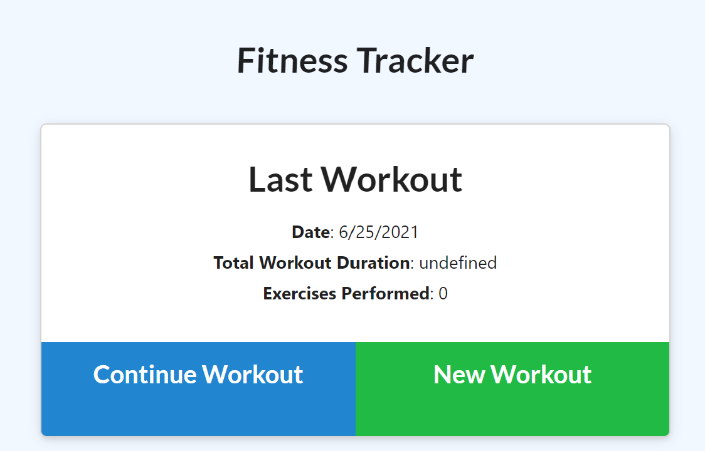
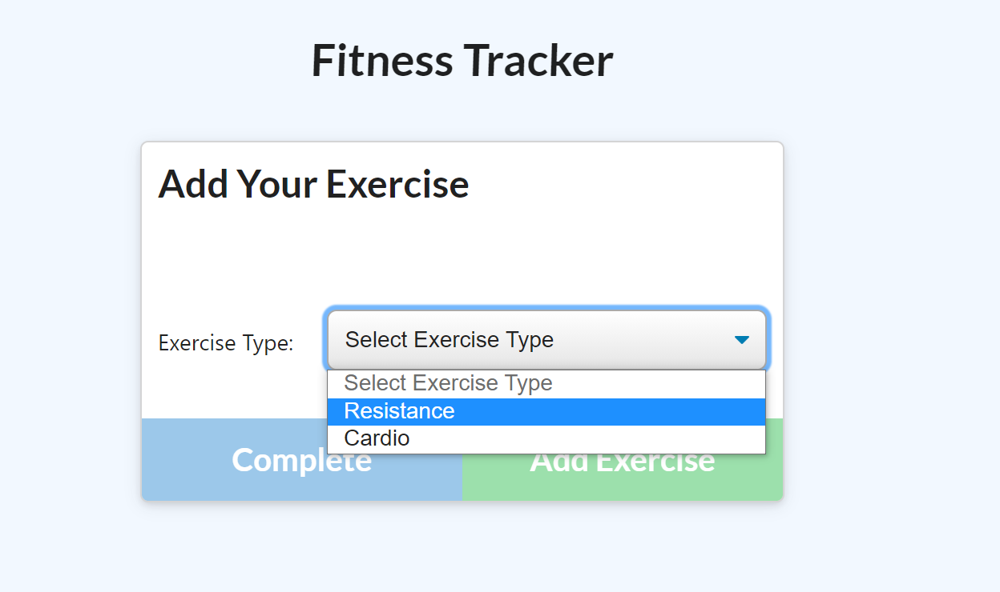
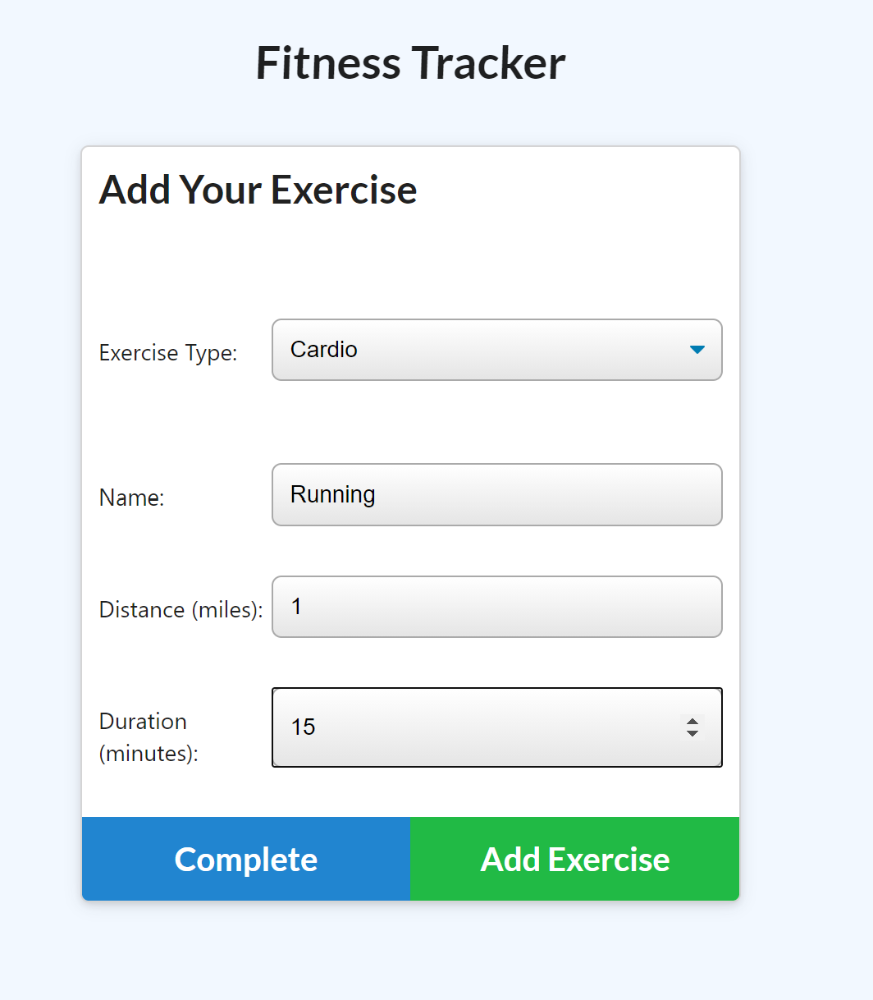
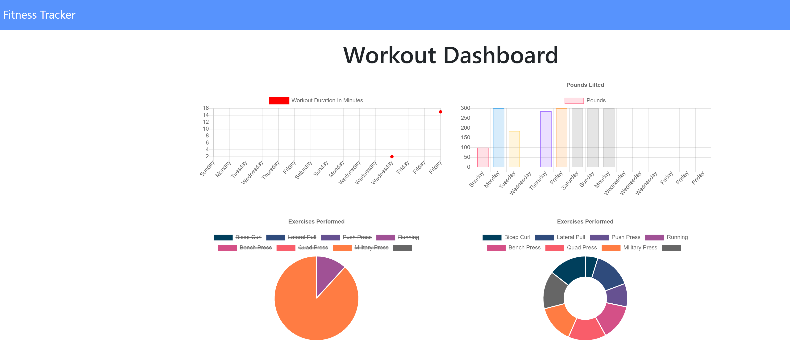

# Fitness Tracker


[http://powerful-thicket-14473.herokuapp.com/](http://powerful-thicket-14473.herokuapp.com/)

## Description
Fitness tracker is an application to track your workout routines. The user can input their own cardio and resistance training and the statistics will be displayed on a Dashboard. Front end code is provided

## Table of Contents
- [Description](#description)
- [Installation](#installation)
- [Usage](#usage)
- [Contributing](#contributing)
- [Questions](#questions)

## Installation
1. Download/clone this repository [Fitness Tracker](https://github.com/melissa-tan/fitness-tracker)
	```
	git clone https://github.com/melissa-tan/fitness-tracker.git
	```
	
2. Install dependencies
	```
	npm install
	```

3. Add `workout` table to the local mongoDB server

4. (Optional) Run seed in your database for starter data
    ```
    npm run seed
    ```

## Usage
1. Run server.js and navigate to [localhost:3001](http://localhost:3001)
    ```
    node server.js
    ```
2. Select `New Workout` to add a new workout <br>
    

3. Select the type of exercise <br>
    

4. Input the information, click add exercise, then click complete<br>
    

5. Click on Dashboard to view your exercise statistics.
    


## Contribution
#### Contributors
[Melissa Tan](https://github.com/melissa-tan)


## Questions
If you have any questions or see any issues, please submit an [issue](https://github.com/melissa-tan/fitness-tracker/issues) on GitHub!

